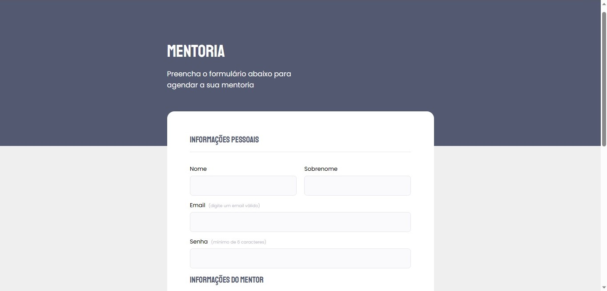

# Formulário02_etapa01_Desafio Prático (Stage 03)

## 🚀 Tecnologias e ferramentas

Esse projeto foi desenvolvido com as seguintes tecnologias:

- HTML e CSS
- Figma
- VSCode
- Git e Github

## 💻 Projeto

O Projeto é um preenchimento de formulário.

## 📝 Aprendizado

 Além de estruturar no HTML e estilizar no CSS em como montar um formulário do zero utilizando o Figma, aprendi também através das minhas pesquisas no google a como deixar o formulário responsivo a todos os tamanhos de telas.

 Link do projeto finalizado: https://naatlr.github.io/Formulario2_etapa1_Desafio-Pratico-Stage03/

💡 Aprendizado pela Rocketseat! 💡
